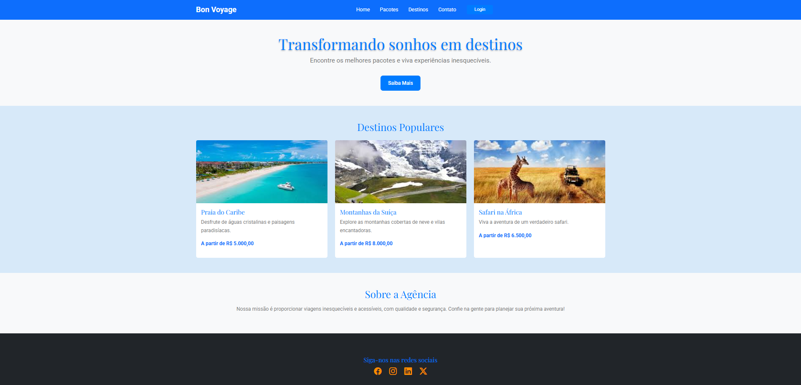

# Projeto Individual - Agência de Viagens 

Um sistema web que reúna e disponibilize materiais educativos sobre as culturas indígenas brasileiras. 

* [Acesse Figma do Projeto](https://www.figma.com/design/NnnFpDu55KePhhF8xtNL3V/Projeto-Indigena-Squad-25?node-id=0-1&m=dev&t=LG2PovfZJaWiqiSd-1)

* [Acesse o Trello](https://trello.com/b/0PejLped/gestao-de-projetos-squad-25)

* [Acesse o Repositório no GitHub](https://github.com/Flimars/projeto-povos-indigenas)

* [Acesse Nosso Site](https://povosindegenas.netlify.app/)

---

### **Participante**: 
 
  * Flávio de Medeiros Lima 
      - [Linkedin](https://www.linkedin.com/in/flaviotheprogrammer/)
      - [GitHub](https://github.com/Flimars)
 
  ---

### **Metodologia de Trabalho**    
- **Análise e Entendimento da proposta**: Solucionar a dificuldade dos consumidores em encontrar e reservar pacotes de viagens de forma prática e segura. O projeto Web **Agência de Viagens Bon Voyage** oferece uma plataforma intuitiva, onde os usuários podem visualizar pacotes turísticos detalhados, realizar reservas online e obterem excelentes experiências.
- **Tecnologias Utilizadas**: HTML, CSS, Bootstrap e JS. 
- **Cronograma**: O projeto será dividido em etapas, para garantir qualidade e cumprimento dos prazos.  

---

### **Cronograma Geral**  

| **Fase**               | **Atividades Principais**                        | **Prazo**         |
|-------------------------|------------------------------------------------|-------------------|
| **1ª Semana** (15-21 jan) | - Compreensão do tema e definição do problema - Brainstorming e planejamento da solução - Estruturação inicial do banco de dados e protótipos do site | 21 jan (terça-feira)  |
| **2ª Semana** (22-28 jan) | - Design UX/UI Figma  - Desenvolvimento do front-end - Implementação do banco de dados - Testes iniciais | 28 jan (terça-feira)  |
| **Finalização** (29 jan - 7 fev) | - Validação do front-end - Ajustes finais - Documentação - Preparação da apresentação | 7 fev (domingo)   |

---

### **Plano Detalhado de Tarefas**  

| **Tarefa**                                                | **Prazo**        |
|-----------------------------------------------------------|------------------|
| Estudo do tema e definição do problema                    | 15-16 jan        |
| Planejamento inicial                                      | 17-18 jan        |
| Modelagem do banco de dados                               | 19-21 jan        |
| Protótipo do front-end - Dedign UX/UI                     | 19-21 jan        |
| Criação do banco de dados - Script                        | 22 jan           |
| Desenvolvimento do front-end (HTML, CSS e JS)             | 22-25 jan        |
| Testes e ajustes  - QA                                    | 03 fev           |
| Criação de documentação (README, etc.) - Documentação     | 05 fev           |
| Preparação e ensaio da apresentação  - Apreentação        | 08-11 fev        |

---

### **Ferramentas de Suporte**  
  
- **Prototipagem**: Figma 
- **Desenvolvimento**: Visual Studio Code 
- **Versionamento de Código**: Git
- **Repositório Remoto**: GitHub
- **Modelagem de Banco de Dados**: Diagrama.dia  
- **Apresentação**: PowerPoint ou Google Slides
- **Deployment**: www.netlify.com  

---
